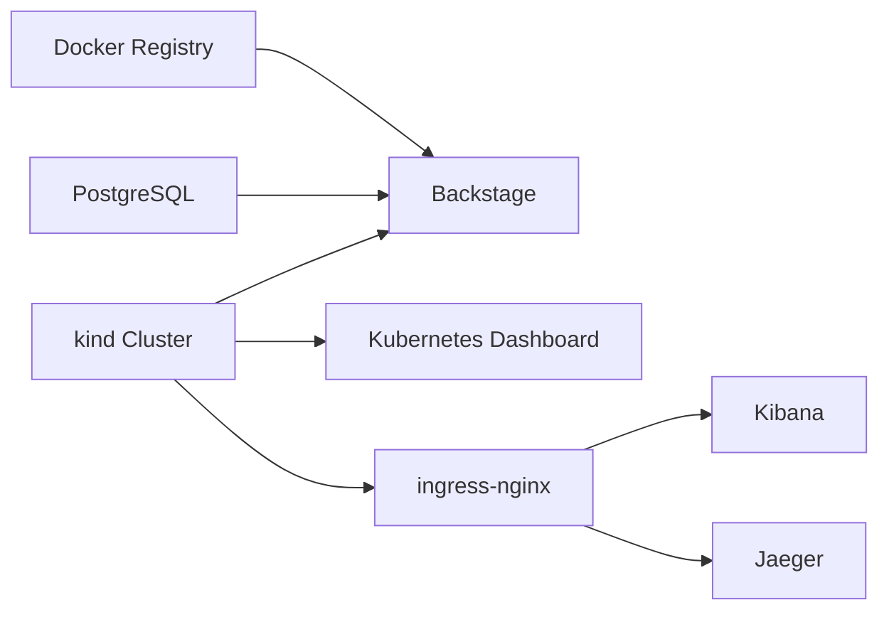

# elegant-infra-engine

This repository provisions a remote Docker registry, PostgreSQL, a `kind` Kubernetes cluster, Backstage, and Kubernetes Dashboard with Terraform. The layout is now split into reusable modules and deployable component roots so you can apply the full platform or only the parts you need.

## Layout

```text
components/
  all/                  Deploy the full stack
  docker-registry/      Deploy Docker registry and registry UI
  postgres/             Deploy PostgreSQL
  kind-cluster/         Deploy the remote kind cluster
  backstage/            Deploy Backstage into an existing cluster
  kubernetes-dashboard/ Deploy Kubernetes Dashboard into an existing cluster
  observability/       Deploy EFK + Jaeger into an existing cluster
modules/
  Reusable Terraform modules shared by the component roots
scripts/
  Shared helper scripts such as the Backstage post-render hook
```



```mermaid
flowchart TD
  Repo["elegant-infra-engine/"]
  Repo --> Components["components/"]
  Repo --> Modules["modules/"]
  Repo --> Scripts["scripts/"]
  Repo --> Readme["README.md"]

  Components --> All["all/"]
  Components --> RegistryComponent["docker-registry/"]
  Components --> PostgresComponent["postgres/"]
  Components --> KindComponent["kind-cluster/"]
  Components --> BackstageComponent["backstage/"]
  Components --> DashboardComponent["kubernetes-dashboard/"]
  Components --> ObservabilityComponent["observability/"]

  Modules --> DockerNetwork["docker-network/"]
  Modules --> RegistryModule["docker-registry/"]
  Modules --> RegistryUiModule["docker-registry-ui/"]
  Modules --> PostgresModule["postgres/"]
  Modules --> KindModule["kind-cluster/"]
  Modules --> NamespaceModule["k8s-namespace/"]
  Modules --> BackstageModule["backstage/"]
  Modules --> DashboardModule["kubernetes-dashboard/"]
  Modules --> IngressNginxModule["ingress-nginx/"]
  Modules --> ObservabilityModule["observability/"]

  Scripts --> BackstageScript["backstage-postrender.sh"]
```

## Architecture

```mermaid
flowchart TD
  All["components/all"] --> DockerNetwork["modules/docker-network"]
  All --> Registry["modules/docker-registry"]
  All --> RegistryUI["modules/docker-registry-ui"]
  All --> Postgres["modules/postgres"]
  All --> Kind["modules/kind-cluster"]
  All --> Namespace["modules/k8s-namespace"]
  All --> Backstage["modules/backstage"]
  All --> Dashboard["modules/kubernetes-dashboard"]
  All --> IngressNginx["modules/ingress-nginx"]
  All --> Observability["modules/observability"]

  RegistryComponent["components/docker-registry"] --> DockerNetwork
  RegistryComponent --> Registry
  RegistryComponent --> RegistryUI

  PostgresComponent["components/postgres"] --> DockerNetwork
  PostgresComponent --> Postgres

  KindComponent["components/kind-cluster"] --> Kind
  BackstageComponent["components/backstage"] --> Namespace
  BackstageComponent --> Backstage
  DashboardComponent["components/kubernetes-dashboard"] --> Namespace
  DashboardComponent --> Dashboard
  ObservabilityComponent["components/observability"] --> Namespace
  ObservabilityComponent --> Observability
```





## Prerequisites

- SSH access to the remote host where Docker is running
- `docker`, `ssh`, and `scp` installed locally
- `terraform` CLI installed locally
- passwordless SSH to the remote host

For any root that creates or changes the `kind` cluster, run Terraform with:

```bash
mkdir -p /tmp/docker-empty-config
printf '{}' > /tmp/docker-empty-config/config.json
export DOCKER_CONFIG=/tmp/docker-empty-config
export DOCKER_HOST=ssh://myserver
```

`DOCKER_HOST` is required because the `kind` provider shells out to the local `kind` CLI, which must talk to the remote Docker daemon. `DOCKER_CONFIG` avoids local credential-helper issues.

## Deployment Modes

Use `components/all` when you want one Terraform root to orchestrate the full platform:

```bash
cd components/all
cp terraform.tfvars.example terraform.tfvars
terraform init
terraform plan
terraform apply
```

## Apply Everything

To provision the full stack from one root:

```bash
cd /Users/mehdi/MyProject/BlitzInfra/components/all
cp terraform.tfvars.example terraform.tfvars
terraform init
mkdir -p /tmp/docker-empty-config
printf '{}' > /tmp/docker-empty-config/config.json
DOCKER_CONFIG=/tmp/docker-empty-config DOCKER_HOST=ssh://myserver terraform apply
```

If you prefer, export the environment once for the current shell:

```bash
export DOCKER_CONFIG=/tmp/docker-empty-config
export DOCKER_HOST=ssh://myserver
terraform -chdir=/Users/mehdi/MyProject/BlitzInfra/components/all apply
```

Replace `myserver` with the same host you set in `ssh_context_host`.

Use the component roots when you want independent deployment lifecycles:

- `components/docker-registry` for the registry and UI
- `components/postgres` for PostgreSQL
- `components/kind-cluster` for the remote `kind` cluster and kubeconfig
- `components/backstage` for Backstage on an existing cluster
- `components/kubernetes-dashboard` for Dashboard on an existing cluster
- `components/observability` for EFK + Jaeger on an existing cluster

Each component root has its own `terraform.tfvars.example`.

## Example Full-Stack Configuration

`components/all/terraform.tfvars.example` is the starting point. It uses grouped objects instead of a flat variable list:

```hcl
ssh_context_host     = "myserver"
ssh_private_key_path = "~/.ssh/id_rsa"
api_server_host      = "myserver"
bootstrap_namespace  = "blitzpay-dev"

registry = {
  network_name   = "registry_net"
  create_network = true
  bind_address   = "0.0.0.0"
  port           = 5000
  ui_bind        = "127.0.0.1"
  ui_port        = 8081
  title          = "Remote Docker Registry"
}

postgres = {
  bind_address = "0.0.0.0"
  port         = 5432
  db_name      = "blitzinfra"
  user         = "blitzinfra"
  password     = "change-me"
  volume_name  = "postgres_data"
}

backstage = {
  enabled       = true
  namespace     = "backstage"
  chart_version = "2.6.3"
  image_tag     = "1.30.2"
  base_url      = "https://myserver:7007"
  expose_public = true
  node_port     = 32007
  host_port     = 7007
}
```

Set real secrets before applying.

If the Docker network already exists on the target host and is not in Terraform state, set `registry.create_network = false` in `components/all` or `components/docker-registry`, or set `postgres.create_network = false` in `components/postgres`, so Terraform reuses the network by name instead of trying to create it again.

## Component Workflows

### Docker Registry

```bash
cd components/docker-registry
cp terraform.tfvars.example terraform.tfvars
terraform init
terraform plan
terraform apply
```

This root deploys the Docker registry and registry UI together, plus the shared Docker network they use.

### PostgreSQL

```bash
cd components/postgres
cp terraform.tfvars.example terraform.tfvars
terraform init
terraform plan
terraform apply
```

This root deploys PostgreSQL and the Docker network it attaches to.

### kind Cluster

```bash
cd components/kind-cluster
cp terraform.tfvars.example terraform.tfvars
terraform init
terraform plan
terraform apply
```

This root creates the remote `kind` cluster and writes a kubeconfig file locally. If you want public Backstage or Dashboard access later, reserve the needed host-port mappings here with `backstage_port_mapping` and `dashboard_port_mapping`.

If you plan to expose services through `ingress-nginx`, also reserve `ingress_http_port_mapping` and `ingress_https_port_mapping` here so the remote host forwards ports `80` and `443` into the kind control-plane node.

### Backstage

```bash
cd components/backstage
cp terraform.tfvars.example terraform.tfvars
terraform init
terraform plan
terraform apply
```

This root expects an existing cluster and an existing PostgreSQL instance. For the current Docker-hosted PostgreSQL pattern, use `host.docker.internal` as the database host from inside the cluster.

If `backstage.expose_public = true`, the cluster must already have the matching host-port mapping reserved by `components/kind-cluster` or `components/all`. Otherwise use `ClusterIP` plus `kubectl port-forward`.

### Kubernetes Dashboard

```bash
cd components/kubernetes-dashboard
cp terraform.tfvars.example terraform.tfvars
terraform init
terraform plan
terraform apply
```

If `dashboard.expose_public = true`, the cluster must already have the matching host-port mapping reserved by `components/kind-cluster` or `components/all`.

Generate a dashboard login token with:

```bash
kubectl --kubeconfig <path-to-kubeconfig> -n kubernetes-dashboard create token admin-user
```

## Force Recreate

Each component root accepts `recreate_revision`. Change it to a new value when you need Terraform to replace the resources managed by that root on the next apply:

```hcl
recreate_revision = "rebuild-2026-03-20-1"
```

Leave it unchanged during normal applies.

## Notes

- Backstage is pinned to a chart version and image tag to avoid drift.
- Backstage still uses the upstream demo image and generated self-signed TLS, which is suitable for bootstrap and evaluation rather than production.
- The Backstage Helm release is post-rendered to force the Deployment strategy to `Recreate`, which avoids migration lock contention against the shared PostgreSQL database.
- Kubernetes Dashboard admin user creation is convenient for dev environments but grants cluster-admin access.


### Observability (EFK + Jaeger)

```bash
cd components/kind-cluster
cp terraform.tfvars.example terraform.tfvars
terraform init
terraform apply

cd components/observability
cp terraform.tfvars.example terraform.tfvars
terraform init
terraform plan
terraform apply
```

This root expects an existing cluster and a valid kubeconfig file. The example uses `../kind-cluster/blitzinfra-kubeconfig`, which is created by `components/kind-cluster`.

If `ingress_nginx.enabled = true`, this root will also install the `ingress-nginx` controller. On the repository's remote-kind pattern, you still need the kind cluster to have `ingress_http_port_mapping` and `ingress_https_port_mapping` reserved first if you want remote traffic to reach ports `80` and `443`.

This root installs:

- **Elasticsearch** for centralized log storage.
- **Fluentd** as a DaemonSet collecting pod/node logs and forwarding them to Elasticsearch.
- **Kibana** for dashboard-based search and visualization.
- **Jaeger** (all-in-one mode) for distributed tracing and APM-like service latency visibility.

## Observability Configuration and Access

### Public access options

For this repository's remote-kind setup, **default examples use public exposure** so Kibana and Jaeger are reachable from other machines (not only the install host). You can still choose either:

1. Use `kubectl port-forward` for local-only access, or
2. Keep NodePort + host-port exposure enabled through `components/kind-cluster` or `components/all` for remote access.

Example port-forward commands:

```bash
kubectl --kubeconfig <path-to-kubeconfig> -n observability port-forward svc/kibana-kibana 5601:5601
kubectl --kubeconfig <path-to-kubeconfig> -n observability port-forward svc/jaeger-query 16686:16686
```

Then open:

- Kibana: `http://localhost:5601`
- Jaeger UI: `http://localhost:16686`

### NodePort-based access

If you set `observability.kibana.expose_public = true` and/or `observability.jaeger.expose_public = true`, configure matching kind host-port mappings:

- Kibana: `observability.kibana.node_port` mapped to `observability.kibana.host_port`
- Jaeger query: `observability.jaeger.query_node_port` mapped to `observability.jaeger.query_host_port`

When exposed publicly from `components/all`, the outputs include:

- `kibana_url`
- `jaeger_query_url`

Remote access from other machines:

- Use `http://<api_server_host>:<kibana_host_port>` for Kibana.
- Use `http://<api_server_host>:<jaeger_query_host_port>` for Jaeger.
- Keep `kind` host-port mappings and firewall/security-group rules open for those ports.

### Ingress-based access

The observability module supports optional Ingress resources for Kibana and Jaeger. This repository can now also install `ingress-nginx`:

- `components/all`: enable `ingress_nginx.enabled = true` and the controller is installed automatically.
- `components/observability`: enable `ingress_nginx.enabled = true` if you want this root to install the controller into an existing cluster.
- `components/kind-cluster`: if the cluster is the repository-managed remote kind cluster, reserve `ingress_http_port_mapping` and `ingress_https_port_mapping` so the remote host exposes ports `80` and `443`.

Example:

```hcl
ingress_nginx = {
  enabled            = true
  namespace          = "ingress-nginx"
  chart_version      = "4.14.2"
  ingress_class_name = "nginx"
  http_node_port     = 32080
  https_node_port    = 32443
}

observability = {
  kibana = {
    enabled       = true
    expose_public = false
    ingress = {
      enabled    = true
      host       = "kibana.example.com"
      class_name = "nginx"
    }
  }

  jaeger = {
    enabled       = true
    expose_public = false
    ingress = {
      enabled    = true
      host       = "jaeger.example.com"
      class_name = "nginx"
    }
  }
}
```

If you want TLS, also set `tls_secret_name` in each ingress block and provision the secret through your ingress workflow.

For simple DNS during development, a wildcard helper such as `nip.io` works well. For example, if your remote host is `myserver` or resolves to `203.0.113.10`, you can use hosts like `kibana.203.0.113.10.nip.io` and `jaeger.203.0.113.10.nip.io`.

## Using Kibana for Log Analysis

1. Open Kibana and create a data view for `logstash-*`.
2. Use Discover to filter by namespace, pod name, or container name.
3. Save useful searches (for example, error-level events from Backstage).
4. Build dashboards with:
   - error count over time,
   - top noisy pods,
   - per-namespace log volume,
   - deployment-event correlation with spikes.
5. Use KQL examples:
   - `kubernetes.namespace_name : "backstage"`
   - `log : "ERROR"`
   - `kubernetes.container_name : "backstage" and log : "timeout"`

## Using Jaeger for Tracing and APM-like Visibility

1. Instrument services with OpenTelemetry/Jaeger SDKs.
2. Configure your apps to send spans to the in-cluster Jaeger collector.
3. Open Jaeger UI and select the service.
4. Analyze:
   - end-to-end request latency,
   - critical path and slow spans,
   - error tags/exceptions,
   - operation-level latency percentiles.
5. For development, all-in-one Jaeger keeps setup simple and low-overhead.

## How EFK and Jaeger Work Together

- **EFK** answers: *what happened* (logs, errors, context).
- **Jaeger** answers: *where time was spent* (spans, dependencies, bottlenecks).
- Together they provide practical day-1 observability for development while keeping a clean path to future upgrades (for example persistent Elasticsearch storage and production-grade Jaeger storage backends).

## Troubleshooting

- **No logs in Kibana**
  - Check Fluentd pods: `kubectl -n observability get pods -l app.kubernetes.io/name=fluentd`
  - Check Fluentd logs for Elasticsearch connection errors.
  - Verify Elasticsearch health: `kubectl -n observability get pods -l app=elasticsearch-master`
- **Provider cannot load Kubernetes client config / default cluster has no server defined**
  - Set `kubeconfig_path` to a valid file.
  - Run `components/kind-cluster` first if you plan to use `../kind-cluster/blitzinfra-kubeconfig`.
  - Confirm the selected kubeconfig context contains a cluster `server` endpoint.
- **Kibana unavailable**
  - Confirm Kibana pod is Ready.
  - Verify service type/NodePort values and kind host-port mappings.
  - If using port-forward, keep the terminal session running.
- **No traces in Jaeger**
  - Confirm app instrumentation and exporter endpoint settings.
  - Check Jaeger collector/query pod logs.
  - Verify clock/time sync issues are not skewing traces.
- **NodePort reachable in cluster but not from remote host**
  - Ensure `components/kind-cluster` or `components/all` includes matching host-port mapping.
  - Confirm firewall/security-group rules allow inbound traffic to chosen host ports.
