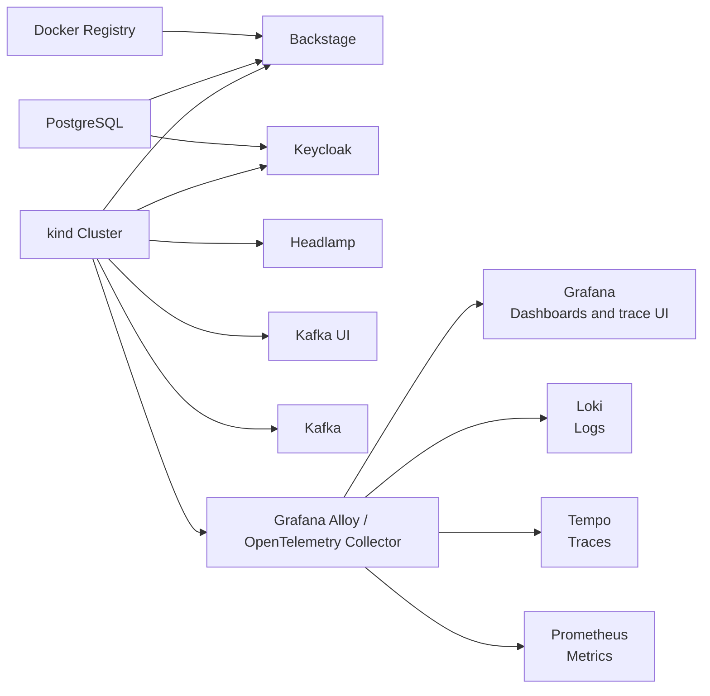

# elegant-infra-engine

This repository provisions a remote Docker registry, PostgreSQL, a `kind` Kubernetes cluster, Backstage, Headlamp, Kafka with an open-source Kafka UI dashboard, Keycloak, and an observability stack (Grafana, Loki, Tempo, and Prometheus) with Terraform. The layout is now split into reusable modules and deployable component roots so you can apply the full platform or only the parts you need.

For contributor workflow and semantic commit guidance, see [CONTRIBUTING.md](/Users/mehdi/MyProject/elegant-infra-engine/CONTRIBUTING.md).
For operator troubleshooting, including the recurring post-reboot `kind` public endpoint failure on the Docker host, see [TROUBLESHOOTING.md](/Users/mehdi/MyProject/elegant-infra-engine/TROUBLESHOOTING.md).

## Exposed URLs

Use Terraform outputs as the source of truth for the live values.

| Service | Public URL | Root | Notes |
| --- | --- | --- | --- |
| Kubernetes API | `https://<api_server_host>:6443` | `components/kind-cluster` or `components/all` | Port follows `kubernetes.api_server_port`. |
| Docker Registry | `http://<api_server_host>:5000` | `components/docker-registry` or `components/all` | Port follows `registry.port`. |
| Registry UI | `http://<api_server_host>:8081` | `components/docker-registry` or `components/all` | If `registry.ui_bind` is `127.0.0.1` or `localhost`, use that bind address instead. |
| Backstage | `https://<api_server_host>:7007/` | `components/backstage` or `components/all` | Requires the matching Backstage host-port mapping on the kind cluster. |
| Headlamp | `http://<api_server_host>:8443/` | `components/headlamp` or `components/all` | Requires the matching Headlamp host-port mapping on the kind cluster. |
| Kafka UI | `http://<api_server_host>:8088` | `components/kafka` or `components/all` | Requires `kafka.expose_dashboard_public = true` and the Docker-managed Kafka UI proxy on the remote host. |
| Keycloak | `http://<api_server_host>:8080/` | `components/keycloak` | Requires `keycloak.expose_public = true` and the matching Keycloak host-port mapping on the kind cluster. |
| Grafana | `http://<api_server_host>:3000` | `components/observability` or `components/all` | Requires `observability.expose_public = true` and the matching Grafana host-port mapping on the kind cluster. |
| Prometheus | `http://<api_server_host>:9090` | `components/observability` or `components/all` | Requires `observability.expose_public = true`, `observability.prometheus.enabled = true`, and the matching Prometheus host-port mapping on the kind cluster. |

For the current example configuration this means:

| Service | Example URL |
| --- | --- |
| Backstage | `https://myserver:7007/` |
| Headlamp | `http://myserver:8443/` |
| Kafka UI | `http://myserver:8088` |
| Keycloak | `http://myserver:8080/` |
| Grafana | `http://myserver:3000` |
| Prometheus | `http://myserver:9090` |

```bash
terraform -chdir=components/all output exposed_urls
terraform -chdir=components/backstage output exposed_urls
terraform -chdir=components/kafka output exposed_urls
terraform -chdir=components/keycloak output exposed_urls
terraform -chdir=components/observability output exposed_urls
```

### Keycloak Without Port Forwarding

To reach Keycloak directly from outside the cluster:

1. Reserve the host-port mapping when creating or recreating the kind cluster:

```hcl
keycloak_port_mapping = {
  node_port = 32080
  host_port = 8080
}
```

2. Deploy Keycloak with public exposure enabled:

```hcl
keycloak = {
  expose_public = true
  node_port     = 32080
  host_port     = 8080
  # other fields omitted
}
```

3. Read the live URL from Terraform:

```bash
terraform -chdir=components/keycloak output keycloak_url
```

## Layout

```text
components/
  all/                  Deploy the full stack
  docker-registry/      Deploy Docker registry and registry UI
  postgres/             Deploy PostgreSQL
  kind-cluster/         Deploy the remote kind cluster
  backstage/            Deploy Backstage into an existing cluster
  headlamp/             Deploy Headlamp into an existing cluster
  kafka/                Deploy Kafka and Kafka UI into an existing cluster
  keycloak/             Deploy Keycloak into an existing cluster
  observability/        Deploy Grafana, Loki, Tempo, and Prometheus into an existing cluster
modules/
  Reusable Terraform modules shared by the component roots
scripts/
  Shared helper scripts such as the Backstage post-render hook
```



```mermaid
flowchart TD
  Repo["elegant-infra-engine/"]
  Repo --> Components["components/"]
  Repo --> Modules["modules/"]
  Repo --> Scripts["scripts/"]
  Repo --> Readme["README.md"]

  Components --> All["all/"]
  Components --> RegistryComponent["docker-registry/"]
  Components --> PostgresComponent["postgres/"]
  Components --> KindComponent["kind-cluster/"]
  Components --> BackstageComponent["backstage/"]
  Components --> HeadlampComponent["headlamp/"]
  Components --> KafkaComponent["kafka/"]
  Components --> KeycloakComponent["keycloak/"]
  Components --> ObservabilityComponent["observability/"]

  Modules --> DockerNetwork["docker-network/"]
  Modules --> RegistryModule["docker-registry/"]
  Modules --> RegistryUiModule["docker-registry-ui/"]
  Modules --> PostgresModule["postgres/"]
  Modules --> KindModule["kind-cluster/"]
  Modules --> NamespaceModule["k8s-namespace/"]
  Modules --> BackstageModule["backstage/"]
  Modules --> HeadlampModule["headlamp/"]
  Modules --> KafkaModule["kafka/"]
  Modules --> KeycloakModule["keycloak/"]
  Modules --> ObservabilityModule["observability/"]

  Scripts --> BackstageScript["backstage-postrender.sh"]
```

## Architecture

```mermaid
flowchart TD
  All["components/all"] --> DockerNetwork["modules/docker-network"]
  All --> Registry["modules/docker-registry"]
  All --> RegistryUI["modules/docker-registry-ui"]
  All --> Postgres["modules/postgres"]
  All --> Kind["modules/kind-cluster"]
  All --> Namespace["modules/k8s-namespace"]
  All --> Backstage["modules/backstage"]
  All --> Headlamp["modules/headlamp"]
  All --> Kafka["modules/kafka"]
  All --> ObservabilityModule["modules/observability"]

  RegistryComponent["components/docker-registry"] --> DockerNetwork
  RegistryComponent --> Registry
  RegistryComponent --> RegistryUI

  PostgresComponent["components/postgres"] --> DockerNetwork
  PostgresComponent --> Postgres

  KindComponent["components/kind-cluster"] --> Kind
  BackstageComponent["components/backstage"] --> Namespace
  BackstageComponent --> Backstage
  HeadlampComponent["components/headlamp"] --> Namespace
  HeadlampComponent --> Headlamp
  KafkaComponent["components/kafka"] --> Namespace
  KafkaComponent --> Kafka
  KeycloakComponent["components/keycloak"] --> Namespace
  KeycloakComponent --> KeycloakModule["modules/keycloak"]
  ObservabilityComponent["components/observability"] --> Namespace
  ObservabilityComponent --> ObservabilityModule["modules/observability"]
```





## Prerequisites

- SSH access to the remote host where Docker is running
- `docker`, `ssh`, and `scp` installed locally
- `terraform` CLI installed locally
- passwordless SSH to the remote host

For any root that creates or changes the `kind` cluster, run Terraform with:

```bash
mkdir -p /tmp/docker-empty-config
printf '{}' > /tmp/docker-empty-config/config.json
export DOCKER_CONFIG=/tmp/docker-empty-config
export DOCKER_HOST=ssh://myserver
```

`DOCKER_HOST` is required because the `kind` provider shells out to the local `kind` CLI, which must talk to the remote Docker daemon. `DOCKER_CONFIG` avoids local credential-helper issues.

## Deployment Modes

Use `components/all` when you want one Terraform root to orchestrate the full platform:

```bash
cd components/all
cp terraform.tfvars.example terraform.tfvars
terraform init
terraform plan
terraform apply
```

## Apply Everything

To provision the full stack from one root:

```bash
cd /Users/mehdi/MyProject/BlitzInfra/components/all
cp terraform.tfvars.example terraform.tfvars
terraform init
mkdir -p /tmp/docker-empty-config
printf '{}' > /tmp/docker-empty-config/config.json
DOCKER_CONFIG=/tmp/docker-empty-config DOCKER_HOST=ssh://myserver terraform apply
```

If you prefer, export the environment once for the current shell:

```bash
export DOCKER_CONFIG=/tmp/docker-empty-config
export DOCKER_HOST=ssh://myserver
terraform -chdir=/Users/mehdi/MyProject/BlitzInfra/components/all apply
```

Replace `myserver` with the same host you set in `ssh_context_host`.

Use the component roots when you want independent deployment lifecycles:

- `components/docker-registry` for the registry and UI
- `components/postgres` for PostgreSQL
- `components/kind-cluster` for the remote `kind` cluster and kubeconfig
- `components/backstage` for Backstage on an existing cluster
- `components/headlamp` for Headlamp on an existing cluster
- `components/kafka` for Kafka and Kafka UI on an existing cluster
- `components/keycloak` for Keycloak on an existing cluster
- `components/observability` for Grafana, Loki, Tempo, and Prometheus on an existing cluster

Each component root has its own `terraform.tfvars.example`.

## Example Full-Stack Configuration

`components/all/terraform.tfvars.example` is the starting point. It uses grouped objects instead of a flat variable list:

```hcl
ssh_context_host     = "myserver"
ssh_private_key_path = "~/.ssh/id_rsa"
api_server_host      = "myserver"
bootstrap_namespace  = "blitzpay-dev"
backstage_backend_auth_key = "replace-with-long-random-secret"
backstage_auth_provider = "keycloak_proxy"
backstage_keycloak_base_url = "http://myserver:8080"
backstage_keycloak_realm = "backstage"
backstage_keycloak_client_id = "backstage"
backstage_keycloak_client_secret = "replace-with-client-secret"
backstage_oauth2_proxy_cookie_secret = "replace-with-base64-cookie-secret"

registry = {
  network_name   = "registry_net"
  create_network = true
  bind_address   = "0.0.0.0"
  port           = 5000
  ui_bind        = "127.0.0.1"
  ui_port        = 8081
  title          = "Remote Docker Registry"
}

postgres = {
  bind_address = "0.0.0.0"
  port         = 5432
  db_name      = "blitzinfra"
  user         = "blitzinfra"
  password     = "change-me"
  volume_name  = "postgres_data"
}

backstage = {
  enabled       = true
  namespace     = "backstage"
  chart_version = "2.6.3"
  image_tag     = "1.30.2"
  base_url      = "https://myserver:7007"
  expose_public = true
  node_port     = 32007
  host_port     = 7007
}

kafka = {
  enabled                  = true
  namespace                = "kafka"
  release_name             = "kafka"
  chart_repository         = "oci://registry-1.docker.io/bitnamicharts"
  chart_name               = "kafka"
  chart_version            = "32.0.2"
  controller_replica_count = 1
  broker_replica_count     = 1
  image_registry           = "docker.io"
  image_repository         = "bitnamilegacy/kafka"
  image_tag                = "4.0.0-debian-12-r10"
  expose_public            = true
  external_node_port       = 32092
  external_host_port       = 9092
  expose_dashboard_public  = true
  dashboard_node_port      = 32081
  dashboard_host_port      = 8088

  dashboard = {
    release_name     = "kafka-ui"
    chart_repository = "https://provectus.github.io/kafka-ui-charts"
    chart_name       = "kafka-ui"
    chart_version    = null
  }
}
```

Set real secrets before applying.

If the Docker network already exists on the target host and is not in Terraform state, set `registry.create_network = false` in `components/all` or `components/docker-registry`, or set `postgres.create_network = false` in `components/postgres`, so Terraform reuses the network by name instead of trying to create it again.

## Component Workflows

### Docker Registry

```bash
cd components/docker-registry
cp terraform.tfvars.example terraform.tfvars
terraform init
terraform plan
terraform apply
```

This root deploys the Docker registry and registry UI together, plus the shared Docker network they use.

### PostgreSQL

```bash
cd components/postgres
cp terraform.tfvars.example terraform.tfvars
terraform init
terraform plan
terraform apply
```

This root deploys PostgreSQL and the Docker network it attaches to.

### kind Cluster

```bash
cd components/kind-cluster
cp terraform.tfvars.example terraform.tfvars
terraform init
terraform plan
terraform apply
```

This root creates the remote `kind` cluster and writes a kubeconfig file locally. If you want public Backstage, Headlamp, or Keycloak access later, reserve the needed host-port mappings here with `backstage_port_mapping`, `headlamp_port_mapping`, and `keycloak_port_mapping`. Kafka and Kafka UI now use separate Docker host proxy paths and do not require dedicated kind host-port mappings.

### Backstage

```bash
cd components/backstage
cp terraform.tfvars.example terraform.tfvars
terraform init
terraform plan
terraform apply
```

This root expects an existing cluster and an existing PostgreSQL instance. For the current Docker-hosted PostgreSQL pattern, set `postgres.access_host` to an address the kind nodes can reach on the Docker host, such as the node gateway `172.19.0.1` in this environment.

If `backstage.expose_public = true`, the cluster must already have the matching host-port mapping reserved by `components/kind-cluster` or `components/all`. Otherwise use `ClusterIP` plus `kubectl port-forward`.

Backstage authentication is OAuth-only in this repo. Set `backstage_auth_provider = "keycloak_proxy"` and provide `backstage_keycloak_base_url`, `backstage_keycloak_realm`, `backstage_keycloak_client_id`, `backstage_keycloak_client_secret`, and `backstage_oauth2_proxy_cookie_secret` in `terraform.tfvars`. Guest auth mode is not supported.
The Backstage `base_url` must use `https://`.

### Headlamp

```bash
cd components/headlamp
cp terraform.tfvars.example terraform.tfvars
terraform init
terraform plan
terraform apply
```

If `headlamp.expose_public = true`, the cluster must already have the matching host-port mapping reserved by `components/kind-cluster` or `components/all`.
Headlamp uses its in-cluster service account by default in this repo. The repo vendors the upstream `0.40.1` chart and patches out the broken `sessionTTL` flag that crashes the current `ghcr.io/headlamp-k8s/headlamp:v0.40.1` image.

When `headlamp.expose_public = true`, access Headlamp at:

```text
http://<api_server_host>:8443
```

For the current example configuration that means:

```text
http://myserver:8443
```

Generate a service-account token for Headlamp with:

```bash
KUBECONFIG=/Users/mehdi/MyProject/elegant-infra-engine/components/all/blitzinfra-kubeconfig \
kubectl -n headlamp create token headlamp
```

### Kafka

```bash
cd components/kafka
cp terraform.tfvars.example terraform.tfvars
terraform init
terraform plan
terraform apply
```

This root expects an existing cluster and installs Kafka together with the open-source Provectus Kafka UI dashboard in one namespace.

Kafka client workloads should use the in-cluster bootstrap server exposed by Terraform outputs:

```bash
terraform -chdir=components/kafka output bootstrap_servers
```

If `kafka.expose_public = true`, this root also creates a lightweight Docker host proxy that forwards `kafka.external_host_port` to the Kafka broker NodePort inside the existing kind cluster. External clients can then bootstrap through:

```text
<api_server_host>:9092
```

For the current example configuration that means:

```text
myserver:9092
```

If `kafka.expose_dashboard_public = true`, this root creates a lightweight Docker host proxy that forwards `kafka.dashboard_host_port` to the Kafka UI NodePort inside the existing kind cluster. That avoids cluster recreation and does not require `kubectl port-forward`.

When `kafka.expose_dashboard_public = true`, access Kafka UI at:

```text
http://<api_server_host>:8088
```

This proxy path requires the same remote Docker SSH access used by the rest of the platform roots because Terraform manages the forwarding container through the remote Docker daemon.

### Keycloak

```bash
cd components/keycloak
cp terraform.tfvars.example terraform.tfvars
terraform init
terraform plan
terraform apply
```

This root expects an existing cluster and an existing PostgreSQL instance. For the current Docker-hosted PostgreSQL pattern, set `postgres.access_host` to an address the kind nodes can reach on the Docker host, such as the node gateway `172.19.0.1` in this environment.

If `keycloak.expose_public = true`, the cluster must already have the matching host-port mapping reserved by `components/kind-cluster`. Otherwise use `kubectl port-forward`.

When `keycloak.expose_public = true`, access Keycloak at:

```text
http://<api_server_host>:8080/
```

### Observability

```bash
cd components/observability
cp terraform.tfvars.example terraform.tfvars
terraform init
terraform plan
terraform apply
```

This root expects an existing cluster and installs Grafana, Loki, Tempo, and Prometheus in one namespace.

The observability stack is intended to cover these roles:

- Grafana for dashboards and trace UI
- Loki for logs
- Prometheus for metrics
- Tempo for traces
- Grafana Alloy or OpenTelemetry Collector as the collector and agent layer that ships telemetry into the backends

If `observability.expose_public = true`, the cluster must already have a matching host-port mapping reserved by your kind cluster configuration. Otherwise use `kubectl port-forward`.

When `observability.expose_public = true`, access Grafana at:

```text
http://<api_server_host>:3000
```

When `observability.expose_public = true` and Prometheus is enabled, access Prometheus at:

```text
http://<api_server_host>:9090
```

## Force Recreate

Each component root accepts `recreate_revision`. Change it to a new value when you need Terraform to replace the resources managed by that root on the next apply:

```hcl
recreate_revision = "rebuild-2026-03-20-1"
```

Leave it unchanged during normal applies.

## Notes

- Backstage is pinned to a chart version and image tag to avoid drift.
- Backstage still uses the upstream demo image and generated self-signed TLS, which is suitable for bootstrap and evaluation rather than production.
- The Backstage Helm release is post-rendered to force the Deployment strategy to `Recreate`, which avoids migration lock contention against the shared PostgreSQL database.
- Headlamp can be granted cluster-admin through its service account for dev environments. Tighten `headlamp.cluster_role_name` before using it beyond local or disposable clusters.
