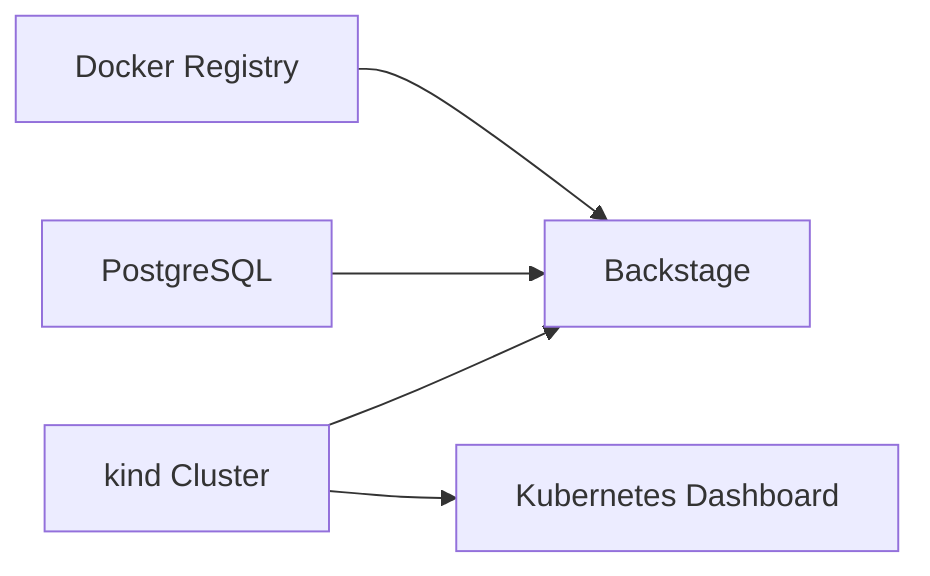

# elegant-infra-engine

This repository provisions a remote Docker registry, PostgreSQL, a `kind` Kubernetes cluster, Backstage, Kubernetes Dashboard, and Zipkin with Terraform. The layout is now split into reusable modules and deployable component roots so you can apply the full platform or only the parts you need.

## Layout

```text
components/
  all/                  Deploy the full stack
  docker-registry/      Deploy Docker registry and registry UI
  postgres/             Deploy PostgreSQL
  kind-cluster/         Deploy the remote kind cluster
  backstage/            Deploy Backstage into an existing cluster
  kubernetes-dashboard/ Deploy Kubernetes Dashboard into an existing cluster
  zipkin/               Deploy Zipkin into an existing cluster
modules/
  Reusable Terraform modules shared by the component roots
scripts/
  Shared helper scripts such as the Backstage post-render hook
```



```mermaid
flowchart TD
  Repo["elegant-infra-engine/"]
  Repo --> Components["components/"]
  Repo --> Modules["modules/"]
  Repo --> Scripts["scripts/"]
  Repo --> Readme["README.md"]

  Components --> All["all/"]
  Components --> RegistryComponent["docker-registry/"]
  Components --> PostgresComponent["postgres/"]
  Components --> KindComponent["kind-cluster/"]
  Components --> BackstageComponent["backstage/"]
  Components --> DashboardComponent["kubernetes-dashboard/"]

  Modules --> DockerNetwork["docker-network/"]
  Modules --> RegistryModule["docker-registry/"]
  Modules --> RegistryUiModule["docker-registry-ui/"]
  Modules --> PostgresModule["postgres/"]
  Modules --> KindModule["kind-cluster/"]
  Modules --> NamespaceModule["k8s-namespace/"]
  Modules --> BackstageModule["backstage/"]
  Modules --> DashboardModule["kubernetes-dashboard/"]

  Scripts --> BackstageScript["backstage-postrender.sh"]
```

## Architecture

```mermaid
flowchart TD
  All["components/all"] --> DockerNetwork["modules/docker-network"]
  All --> Registry["modules/docker-registry"]
  All --> RegistryUI["modules/docker-registry-ui"]
  All --> Postgres["modules/postgres"]
  All --> Kind["modules/kind-cluster"]
  All --> Namespace["modules/k8s-namespace"]
  All --> Backstage["modules/backstage"]
  All --> Dashboard["modules/kubernetes-dashboard"]

  RegistryComponent["components/docker-registry"] --> DockerNetwork
  RegistryComponent --> Registry
  RegistryComponent --> RegistryUI

  PostgresComponent["components/postgres"] --> DockerNetwork
  PostgresComponent --> Postgres

  KindComponent["components/kind-cluster"] --> Kind
  BackstageComponent["components/backstage"] --> Namespace
  BackstageComponent --> Backstage
  DashboardComponent["components/kubernetes-dashboard"] --> Namespace
  DashboardComponent --> Dashboard
```





## Prerequisites

- SSH access to the remote host where Docker is running
- `docker`, `ssh`, and `scp` installed locally
- `terraform` CLI installed locally
- passwordless SSH to the remote host

For any root that creates or changes the `kind` cluster, run Terraform with:

```bash
mkdir -p /tmp/docker-empty-config
printf '{}' > /tmp/docker-empty-config/config.json
export DOCKER_CONFIG=/tmp/docker-empty-config
export DOCKER_HOST=ssh://myserver
```

`DOCKER_HOST` is required because the `kind` provider shells out to the local `kind` CLI, which must talk to the remote Docker daemon. `DOCKER_CONFIG` avoids local credential-helper issues.

## Deployment Modes

Use `components/all` when you want one Terraform root to orchestrate the full platform:

```bash
cd components/all
cp terraform.tfvars.example terraform.tfvars
terraform init
terraform plan
terraform apply
```

## Apply Everything

To provision the full stack from one root:

```bash
cd /Users/mehdi/MyProject/BlitzInfra/components/all
cp terraform.tfvars.example terraform.tfvars
terraform init
mkdir -p /tmp/docker-empty-config
printf '{}' > /tmp/docker-empty-config/config.json
DOCKER_CONFIG=/tmp/docker-empty-config DOCKER_HOST=ssh://myserver terraform apply
```

If you prefer, export the environment once for the current shell:

```bash
export DOCKER_CONFIG=/tmp/docker-empty-config
export DOCKER_HOST=ssh://myserver
terraform -chdir=/Users/mehdi/MyProject/BlitzInfra/components/all apply
```

Replace `myserver` with the same host you set in `ssh_context_host`.

Use the component roots when you want independent deployment lifecycles:

- `components/docker-registry` for the registry and UI
- `components/postgres` for PostgreSQL
- `components/kind-cluster` for the remote `kind` cluster and kubeconfig
- `components/backstage` for Backstage on an existing cluster
- `components/kubernetes-dashboard` for Dashboard on an existing cluster
- `components/zipkin` for Zipkin on an existing cluster

Each component root has its own `terraform.tfvars.example`.

## Example Full-Stack Configuration

`components/all/terraform.tfvars.example` is the starting point. It uses grouped objects instead of a flat variable list:

```hcl
ssh_context_host     = "myserver"
ssh_private_key_path = "~/.ssh/id_rsa"
api_server_host      = "myserver"
bootstrap_namespace  = "blitzpay-dev"

registry = {
  network_name   = "registry_net"
  create_network = true
  bind_address   = "0.0.0.0"
  port           = 5000
  ui_bind        = "127.0.0.1"
  ui_port        = 8081
  title          = "Remote Docker Registry"
}

postgres = {
  bind_address = "0.0.0.0"
  port         = 5432
  db_name      = "blitzinfra"
  user         = "blitzinfra"
  password     = "change-me"
  volume_name  = "postgres_data"
}

backstage = {
  enabled       = true
  namespace     = "backstage"
  chart_version = "2.6.3"
  image_tag     = "1.30.2"
  base_url      = "https://myserver:7007"
  expose_public = true
  node_port     = 32007
  host_port     = 7007
}
```

Set real secrets before applying.

If the Docker network already exists on the target host and is not in Terraform state, set `registry.create_network = false` in `components/all` or `components/docker-registry`, or set `postgres.create_network = false` in `components/postgres`, so Terraform reuses the network by name instead of trying to create it again.

## Component Workflows

### Docker Registry

```bash
cd components/docker-registry
cp terraform.tfvars.example terraform.tfvars
terraform init
terraform plan
terraform apply
```

This root deploys the Docker registry and registry UI together, plus the shared Docker network they use.

### PostgreSQL

```bash
cd components/postgres
cp terraform.tfvars.example terraform.tfvars
terraform init
terraform plan
terraform apply
```

This root deploys PostgreSQL and the Docker network it attaches to.

### kind Cluster

```bash
cd components/kind-cluster
cp terraform.tfvars.example terraform.tfvars
terraform init
terraform plan
terraform apply
```

This root creates the remote `kind` cluster and writes a kubeconfig file locally. If you want public Backstage, Dashboard, or Zipkin access later, reserve the needed host-port mappings here with `backstage_port_mapping`, `dashboard_port_mapping`, and `zipkin_port_mapping`.

### Backstage

```bash
cd components/backstage
cp terraform.tfvars.example terraform.tfvars
terraform init
terraform plan
terraform apply
```

This root expects an existing cluster and an existing PostgreSQL instance. For the current Docker-hosted PostgreSQL pattern, use `host.docker.internal` as the database host from inside the cluster.

If `backstage.expose_public = true`, the cluster must already have the matching host-port mapping reserved by `components/kind-cluster` or `components/all`. Otherwise use `ClusterIP` plus `kubectl port-forward`.

### Kubernetes Dashboard

```bash
cd components/kubernetes-dashboard
cp terraform.tfvars.example terraform.tfvars
terraform init
terraform plan
terraform apply
```

If `dashboard.expose_public = true`, the cluster must already have the matching host-port mapping reserved by `components/kind-cluster` or `components/all`.

Generate a dashboard login token with:

```bash
kubectl --kubeconfig <path-to-kubeconfig> -n kubernetes-dashboard create token admin-user
```


### Zipkin

```bash
cd components/zipkin
cp terraform.tfvars.example terraform.tfvars
terraform init
terraform plan
terraform apply
```

If `zipkin.expose_public = true`, the cluster must already have the matching host-port mapping reserved by `components/kind-cluster` or `components/all`.

## Force Recreate

Each component root accepts `recreate_revision`. Change it to a new value when you need Terraform to replace the resources managed by that root on the next apply:

```hcl
recreate_revision = "rebuild-2026-03-20-1"
```

Leave it unchanged during normal applies.

## Notes

- Backstage is pinned to a chart version and image tag to avoid drift.
- Backstage still uses the upstream demo image and generated self-signed TLS, which is suitable for bootstrap and evaluation rather than production.
- The Backstage Helm release is post-rendered to force the Deployment strategy to `Recreate`, which avoids migration lock contention against the shared PostgreSQL database.
- Kubernetes Dashboard admin user creation is convenient for dev environments but grants cluster-admin access.
