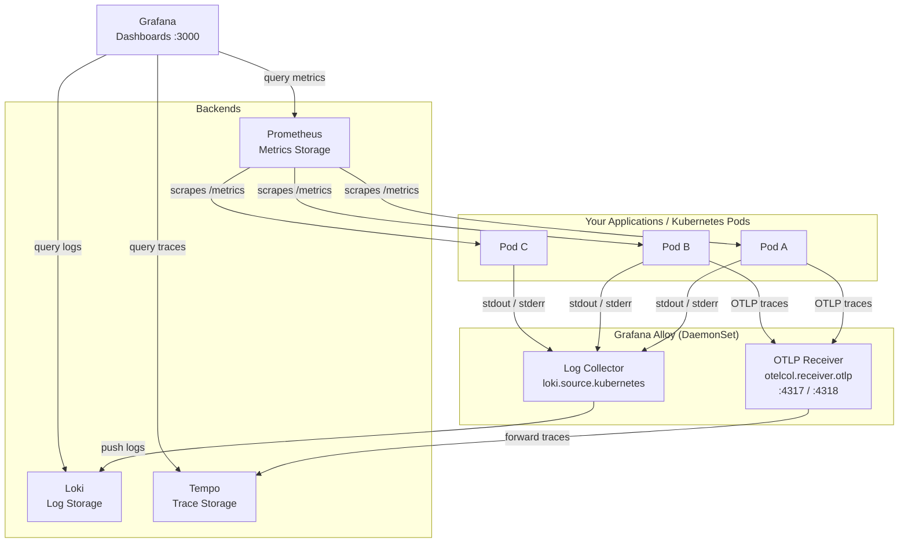
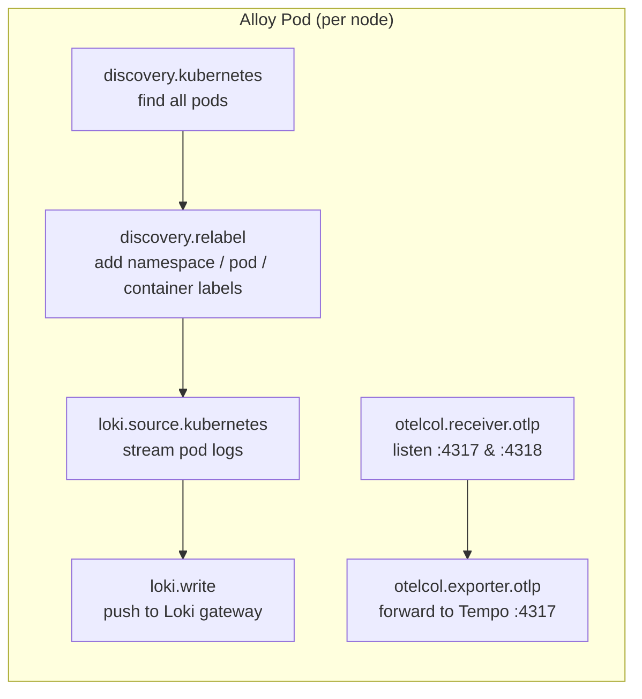
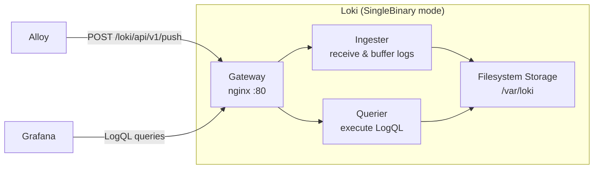
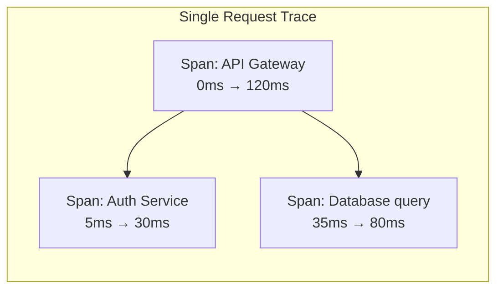
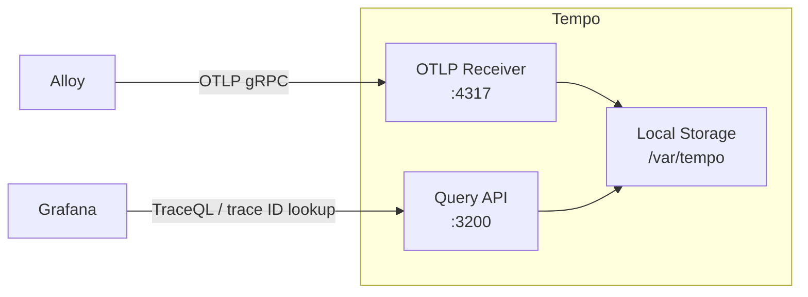
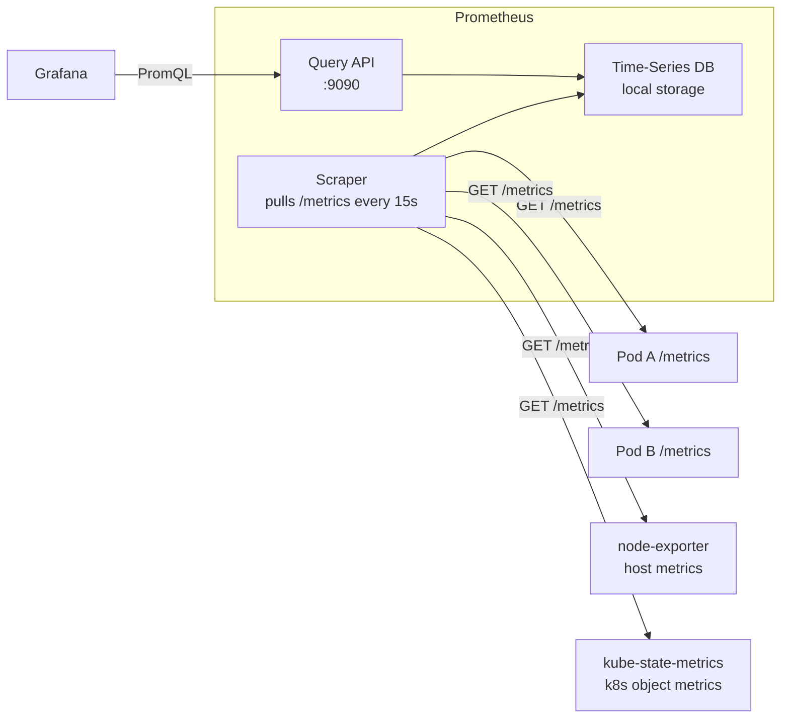
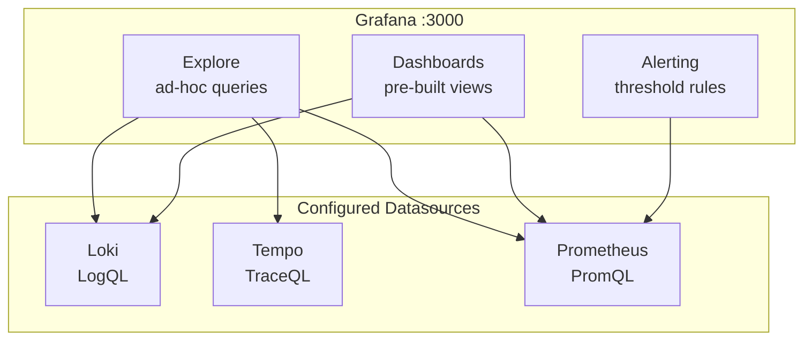
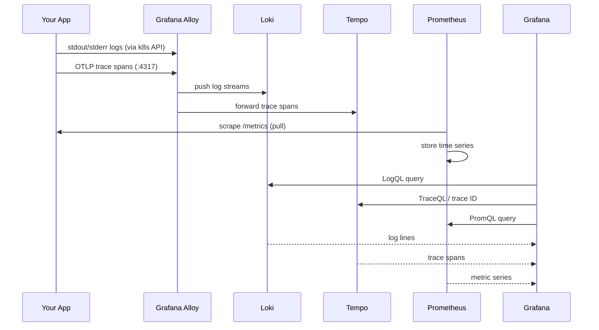

# Observability Stack Reference

This document explains the observability stack deployed in BlitzInfra: what each component does, how they connect, and how data flows through the system.

---

## Components at a Glance

| Component | Role | Port |
|-----------|------|------|
| **Grafana Alloy** | Collector — gathers logs and receives traces, ships to backends | 4317 (OTLP gRPC), 4318 (OTLP HTTP) |
| **Loki** | Log storage and query engine | 3100 (internal), gateway on 80 |
| **Tempo** | Distributed trace storage and query engine | 3200 (query), 4317 (OTLP ingest) |
| **Prometheus** | Metrics scraping and storage | 9090 |
| **Grafana** | Dashboards and unified UI for all backends | 3000 |

---

## How They Work Together



---

## Grafana Alloy

Alloy is the **collector** — it runs as a DaemonSet (one pod per node) and is responsible for gathering telemetry and shipping it to the right backend.

In this stack Alloy does two things:

1. **Log collection**: watches Kubernetes pod logs via the API and forwards them to Loki
2. **Trace ingestion**: listens for OTLP traces from your apps and forwards them to Tempo



Alloy's configuration is written in **River** (Alloy's own DSL), defined in the Helm chart as a ConfigMap. Each block declares a component with inputs and outputs — data flows like a pipeline.

---

## Loki

Loki is the **log backend**. Unlike traditional log systems (e.g. Elasticsearch), Loki does **not** index log content. It only indexes the **labels** attached to log streams (namespace, pod, container, app). The actual log lines are stored compressed in chunks.

This makes Loki cheap to run but means you query by label first, then filter by content.



**LogQL** is Loki's query language. Example:

```logql
{namespace="backstage"} |= "error"
```

This means: show me all log lines from the `backstage` namespace that contain the word "error".

---

## Tempo

Tempo is the **trace backend**. A trace represents a single request as it travels through multiple services. Each trace is made up of **spans** — individual units of work with a start time, duration, and metadata.





Your apps send traces using the **OpenTelemetry** SDK. Alloy receives them on port 4317 (gRPC) or 4318 (HTTP) and forwards them to Tempo.

---

## Prometheus

Prometheus is the **metrics backend**. It works by **pulling** (scraping) metrics from your apps and services on a schedule — your app exposes a `/metrics` HTTP endpoint and Prometheus calls it every 15–60 seconds.



**PromQL** is Prometheus's query language. Example:

```promql
rate(http_requests_total{namespace="backstage"}[5m])
```

This means: show me the per-second request rate for Backstage averaged over the last 5 minutes.

---

## Grafana

Grafana is the **unified UI**. It does not store any data itself — it connects to Loki, Tempo, and Prometheus as datasources and lets you query and visualize everything in one place.



### Navigating Grafana

- **Explore** (compass icon): free-form querying — pick a datasource, write a query, see results
- **Dashboards** (four squares): pre-built panels for Kubernetes, Loki, etc.
- **Alerting** (bell icon): define rules that fire when a metric crosses a threshold

### Trace → Log correlation

Because Alloy attaches the same labels (namespace, pod, container) to both logs and traces, Grafana can jump from a slow trace directly to the logs from that pod at that exact timestamp. This is wired up via the `tracesToLogs` link in the Tempo datasource configuration.

---

## Data Flow Summary


